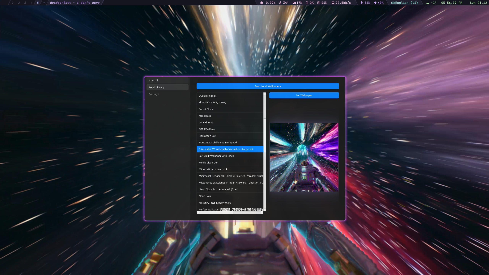
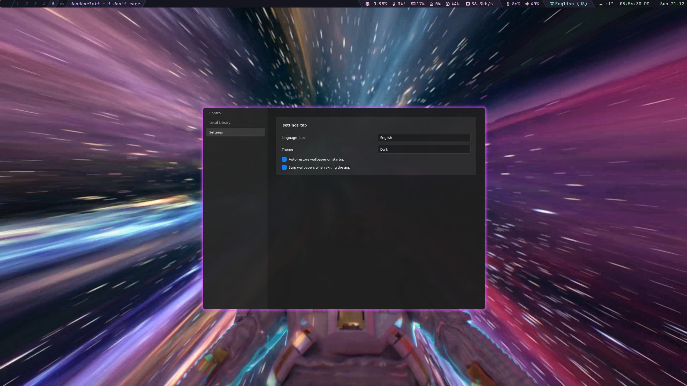

# Simple Linux Wallpaper Engine GUI

A modern, universal GUI for [linux-wallpaperengine](https://github.com/Almamu/linux-wallpaperengine).

## Screenshots
<p align="center">
  
  
</p>
<p align="center">
  
</p>

## 1. Prerequisites (The Backend)
This is just a GUI. You **must** install the core backend engine first.

### Arch / Manjaro
```bash
yay -S linux-wallpaperengine
```

### Debian / Ubuntu / Fedora (Build from Source)
Detailed instructions are [here](https://github.com/Almamu/linux-wallpaperengine#compiling), but essentially:
```bash
# Install build tools (Debian/Ubuntu)
sudo apt install build-essential cmake libx11-dev libxrandr-dev liblz4-dev

# Install build tools (Fedora)
sudo dnf install cmake gcc-c++ libX11-devel libXrandr-devel lz4-devel

# Clone & Build
git clone https://github.com/Almamu/linux-wallpaperengine.git
cd linux-wallpaperengine && mkdir build && cd build
cmake ..
make
sudo make install
```

## 2. Installation (The GUI)

This one-step script detects your OS (Ubuntu, Fedora, Arch), installs Python dependencies, and sets up the app.

```bash
git clone https://github.com/Maxnights/simple-linux-wallpaperengine-gui.git
cd simple-linux-wallpaperengine-gui
chmod +x install.sh
./install.sh
```

## 3. Usage

Start the application:

```bash
./run_gui.sh
```


## Troubleshooting

**"linux-wallpaperengine not found"**  
Ensure you completed Step 1. Run `linux-wallpaperengine --help` in a terminal to verify it's installed globally.

**Wallpapers not showing?**  
Go to the **Library** tab and click **Scan Local Wallpapers**. The app searches standard paths including `~/.local/share/Steam`, `~/.var/app/com.valvesoftware.Steam`, and `~/snap/steam`.